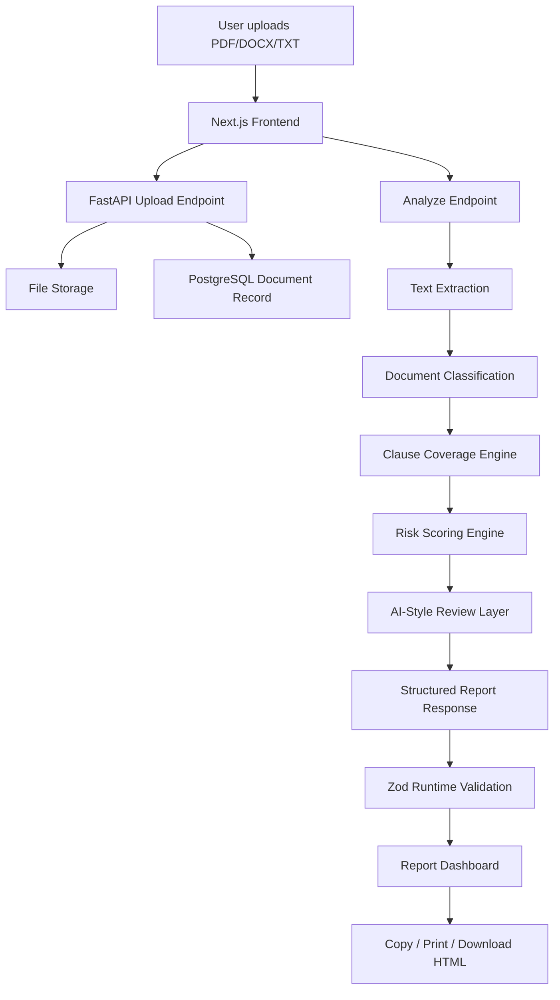

# DocuSense AI

DocuSense AI is a full-stack document risk intelligence platform that analyzes PDF, DOCX, and TXT documents and turns them into structured risk reports.

The product helps users review HR policies, school policies, contracts, leases, offer letters, and compliance documents by combining document upload, text extraction, document classification, clause coverage analysis, calibrated risk scoring, AI-style review notes, suggested rewrites, and exportable reports.

> Status: Active portfolio project  
> Live demo: Coming soon  
> Backend: FastAPI + PostgreSQL  
> Frontend: Next.js + TypeScript + Zod

---

## Quick Links

| Area | Link |
|---|---|
| GitHub Repo | https://github.com/stomarp/docuguard-hr |
| Live Demo | Coming soon |
| Frontend | `frontend/` |
| Backend | `backend/` |
| API Docs | `http://127.0.0.1:8010/docs` |
| Local Frontend | `http://localhost:3001` |

---

## Recruiter Scan

DocuSense AI demonstrates full-stack product engineering, backend API design, document processing, ML-assisted classification, schema-safe frontend development, and product thinking.

### What this project demonstrates

- Full-stack SaaS-style product development
- FastAPI backend architecture
- PostgreSQL-backed document/report workflow
- PDF/DOCX/TXT upload and text extraction
- Document classification and clause coverage
- Calibrated long-document risk scoring
- AI-style executive review and suggested rewrites
- Next.js dashboard with TypeScript
- Runtime API validation using Zod
- Sample demo mode for recruiter-friendly testing
- Copy summary, print report, and downloadable HTML export

---

## Product Problem

Reviewing long documents like HR policy manuals, contracts, offer letters, and compliance documents is time-consuming. Important risks can be hidden inside vague language, missing clauses, unclear obligations, or inconsistent policy wording.

DocuSense AI helps users quickly answer:

- What type of document is this?
- What important sections are present or missing?
- What language could create risk or ambiguity?
- What should be reviewed first?
- What rewrite suggestions would make the document clearer?
- Can I export a structured review report?

---

## Product Features

### Document Upload and Text Extraction

Users can upload PDF, DOCX, and TXT documents. The backend extracts text and prepares it for analysis.

### Document Classification

DocuSense AI classifies documents such as:

- HR Policy Manual
- Education / School Policy
- Contract
- Lease Agreement
- Offer Letter
- HR Policy
- Compliance Document
- General Document

### Clause Coverage Analysis

The platform checks expected sections for the detected document type. For an HR Policy Manual, it can check sections such as Equal Employment Opportunity, Harassment / Conduct, Hiring, Performance Evaluation, Compensation, Leave, Telecommuting, and Confidentiality.

### Calibrated Risk Scoring

DocuSense AI uses calibrated scoring so long documents are not unfairly punished for common policy words like “may” or “reasonable.” It prioritizes stronger risk signals such as “sole discretion” and “without notice.”

### AI-Style Review Layer

The system generates structured review guidance including executive summary, reviewer verdict, user warning, next-best action, suggested rewrites, and review checklist.

The current implementation is deterministic and LLM-ready. It is designed so an external LLM can be added later without changing the frontend contract.

### Export Workflow

Users can try a sample report, copy the executive summary, download an HTML report, print the report, and clear the report.

---

## Architecture



---

## Tech Stack

### Backend

- Python
- FastAPI
- SQLAlchemy
- PostgreSQL
- Pydantic
- PDF/DOCX/TXT text extraction
- Rule-based risk intelligence engine
- ML-assisted document signals

### Frontend

- Next.js
- TypeScript
- Zod
- CSS
- Browser-based HTML export

### Dev Tools

- Docker Compose
- Uvicorn
- Git / GitHub
- Local API docs with Swagger

---

## API Flow

### Health Check

```http
GET /health
```

### Upload Document

```http
POST /upload
```

Uploads a PDF, DOCX, or TXT document and returns the stored filename.

### Analyze Document

```http
POST /analyze/{stored_filename}
```

Returns a structured report with analysis metadata, document classification, summary, scores, findings, recommendations, AI review, ML insights, metadata, and debug information.

### View Documents

```http
GET /documents
```

### View Report History

```http
GET /documents/{document_id}/reports
```

---

## Local Development

### Start PostgreSQL

```bash
docker compose up -d db
```

### Start Backend

```bash
python -m uvicorn backend.app.main:app --port 8010
```

Backend runs at:

```text
http://127.0.0.1:8010
```

Swagger API docs:

```text
http://127.0.0.1:8010/docs
```

### Start Frontend

```bash
npm --prefix frontend run dev
```

Frontend runs at:

```text
http://localhost:3001
```

---

## Validation and Build Checks

### Backend compile check

```bash
python3 -m py_compile backend/app/main.py backend/app/services/risk_intelligence.py backend/app/services/ai_review.py
```

### Frontend production build

```bash
npm --prefix frontend run build
```

---

## Screenshots

Recommended screenshot names:

- `docs/screenshots/landing.png`
- `docs/screenshots/report-dashboard.png`
- `docs/screenshots/suggested-rewrites.png`
- `docs/screenshots/export-workflow.png`

---

## What Makes This Different

DocuSense AI is not a simple chatbot wrapper.

It includes backend document processing, persistent upload/report workflow, classification logic, clause coverage engine, calibrated scoring, AI-style review layer, typed frontend contract, runtime validation, and exportable report workflow.

The product is designed around a realistic document review workflow rather than a single prompt-response interaction.

---

## Limitations

- External LLM integration is not enabled yet
- AI review layer is deterministic and LLM-ready
- Legal/compliance outputs are informational and not legal advice
- Classification uses weighted signals and can be improved with more labeled training data
- HTML export is available; PDF export can be added later
- Deployment is not completed yet

---

## Future Work

- Deploy backend on Render
- Deploy frontend on Vercel
- Rename repository to `docusense-ai`
- Add OpenAI-powered review mode
- Add PDF report export
- Add authentication
- Add document comparison
- Add organization/team workspaces
- Add backend tests for classification and scoring
- Add CI checks for backend compile and frontend build

---

## Resume Summary

DocuSense AI is a full-stack document risk intelligence platform built with FastAPI, PostgreSQL, Next.js, TypeScript, and Zod. It analyzes uploaded documents, classifies document type, detects clause gaps and risky language, generates calibrated risk scores, provides AI-style review recommendations, and exports structured reports.
