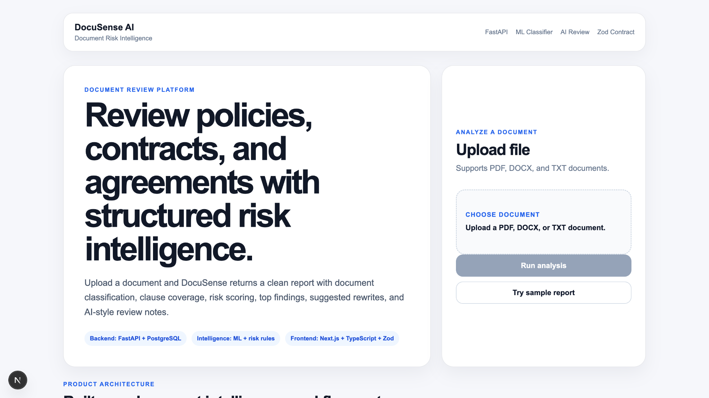
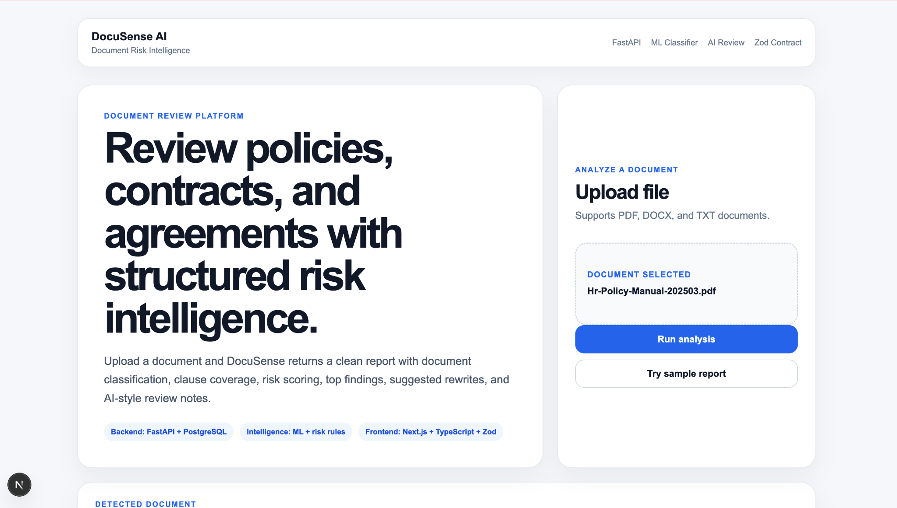
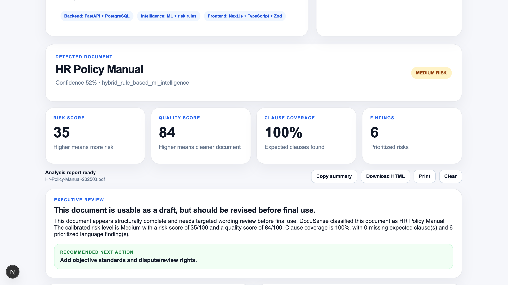
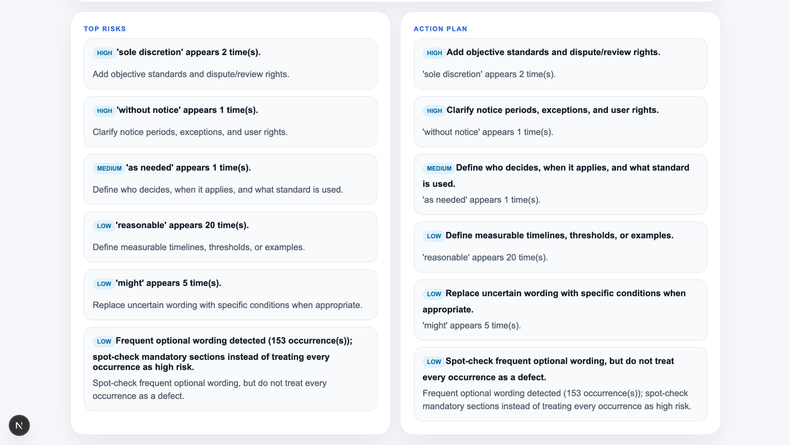
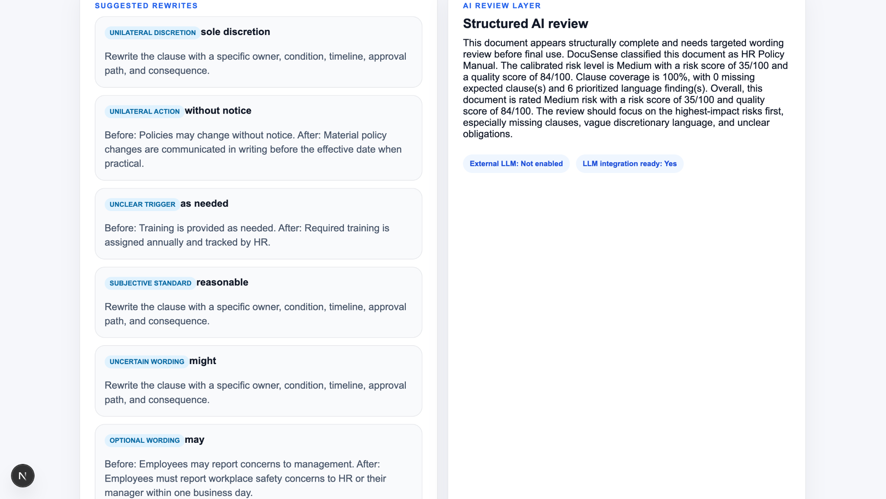
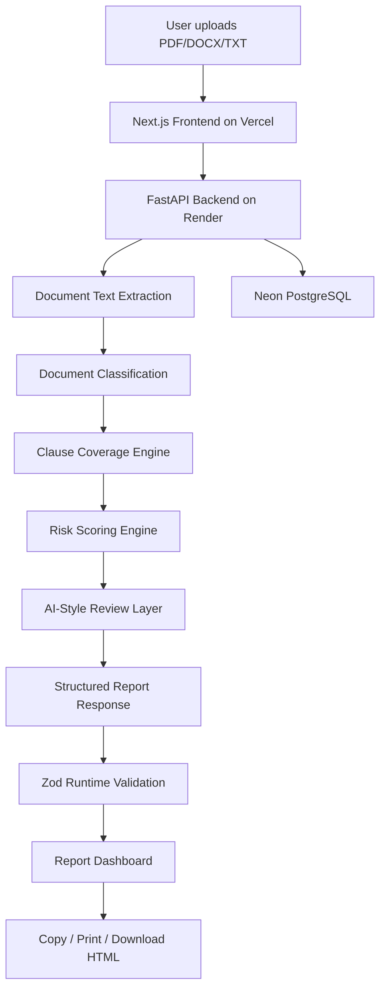

# DocuSense AI

[](https://github.com/stomarp/docusense-ai/actions/workflows/ci.yml)

DocuSense AI is a deployed full-stack document risk intelligence platform that analyzes PDF, DOCX, and TXT documents and generates structured review reports with document classification, clause coverage, calibrated risk scoring, top findings, suggested rewrites, and exportable summaries.

The project is built as a practical SaaS-style workflow, not a chatbot wrapper. Users can upload a document, run analysis, review prioritized risks, copy the executive summary, print the report, or download an HTML report.

## Live Demo

| Area | Link |
|---|---|
| Live App | https://docusense-ai-six.vercel.app |
| Production API | https://docusense-ai-api-vg1h.onrender.com |
| API Health Check | https://docusense-ai-api-vg1h.onrender.com/health |
| GitHub Repo | https://github.com/stomarp/docusense-ai |
| Architecture Doc | docs/ARCHITECTURE.md |
| Deployment Guide | docs/DEPLOYMENT_GUIDE.md |
| Recruiter Brief | docs/RECRUITER_BRIEF.md |
| Demo Script | docs/DEMO_SCRIPT.md |

## For Recruiters

The fastest way to review this project:

1. Open the live app: https://docusense-ai-six.vercel.app
2. Click `Try sample report`
3. Review the report dashboard, top risks, suggested rewrites, and export actions
4. Read the short recruiter brief: `docs/RECRUITER_BRIEF.md`
5. Check CI status from the README badge

This project is designed to show full-stack product engineering, backend API design, typed frontend contracts, deployment, and practical AI-style workflow design.

## Recruiter Scan

DocuSense AI demonstrates full-stack software engineering, backend API design, document processing, risk-scoring logic, schema-safe frontend development, deployment, and product thinking.

### Highlights

- Deployed full-stack app with Next.js frontend, FastAPI backend, and Neon PostgreSQL
- PDF/DOCX/TXT upload and document text extraction workflow
- Document classification for HR policies, contracts, leases, offer letters, compliance docs, and general documents
- Clause coverage analysis and missing-section detection
- Calibrated long-document risk scoring to avoid false high-risk results
- AI-style executive review, next-best action, suggested rewrites, and review checklist
- TypeScript frontend with Zod runtime API validation
- Sample report mode for recruiter-friendly demos
- Copy summary, print report, and downloadable HTML report export
- Production deployment on Vercel + Render + Neon

## Product Problem

Long documents such as HR policy manuals, contracts, offer letters, leases, and compliance documents are difficult to review quickly. Important issues can be hidden inside vague wording, missing clauses, unclear obligations, or risky discretionary language.

DocuSense AI helps users quickly answer:

- What type of document is this?
- Which important sections are present or missing?
- What language could create risk or ambiguity?
- Which findings should be reviewed first?
- What rewrite suggestions would make the document clearer?
- Can I export a structured review report?

## Demo Flow

1. Open the live app.
2. Click `Try sample report` or upload a PDF/DOCX/TXT document.
3. Run analysis.
4. Review the detected document type, risk score, quality score, clause coverage, and top findings.
5. Review suggested rewrites and AI-style review notes.
6. Copy the summary, print the report, or download the HTML report.

## Screenshots

### Landing and Upload Flow



### Uploaded Document State



### Report Dashboard



### Top Risks and Action Plan



### Suggested Rewrites and AI Review



## Architecture



## Tech Stack

### Backend

- Python
- FastAPI
- SQLAlchemy
- PostgreSQL
- Pydantic
- Uvicorn
- PDF/DOCX/TXT text extraction
- Rule-based risk intelligence engine
- ML-ready document classification signals

### Frontend

- Next.js
- TypeScript
- Zod
- CSS
- Browser-based HTML export

### Deployment

- Vercel for frontend
- Render for FastAPI backend
- Neon PostgreSQL for production database
- Render Blueprint configuration
- Production smoke test script

## Core Features

### Document Upload and Extraction

Users can upload PDF, DOCX, and TXT documents. The backend stores document metadata, extracts text, and prepares the content for analysis.

### Document Classification

DocuSense AI classifies documents such as:

- HR Policy Manual
- Education / School Policy
- Contract
- Lease Agreement
- Offer Letter
- HR Policy
- Compliance Document
- General Document

### Clause Coverage Analysis

The platform checks expected sections for the detected document type. For an HR Policy Manual, it can check sections such as Equal Employment Opportunity, Harassment / Conduct, Hiring, Performance Evaluation, Compensation, Leave, Telecommuting, and Confidentiality.

### Calibrated Risk Scoring

DocuSense AI uses calibrated scoring so long documents are not unfairly punished for common policy words like "may" or "reasonable." It prioritizes stronger risk signals such as "sole discretion" and "without notice."

### AI-Style Review Layer

The system generates structured review guidance including:

- Executive summary
- Reviewer verdict
- User warning / disclaimer
- Next-best action
- Suggested rewrites
- Review checklist

The current review layer is deterministic and LLM-ready. It is designed so an external LLM can be added later without changing the frontend contract.

### Export Workflow

Users can:

- Try a sample report
- Copy the executive summary
- Download an HTML report
- Print the report
- Clear the report and start again

## Production API

The deployed backend exposes a root route and health check:

```text
https://docusense-ai-api-vg1h.onrender.com/
https://docusense-ai-api-vg1h.onrender.com/health
```

The root route returns product metadata, while `/health` is used by Render health checks and the production smoke test.
## API Overview

### Health Check

```http
GET /health
```

### Upload Document

```http
POST /upload
```

Uploads a PDF, DOCX, or TXT document and returns the stored filename.

### Analyze Document

```http
POST /analyze/{stored_filename}
```

Returns a structured report with analysis metadata, document classification, summary, scores, findings, recommendations, AI review, ML insights, metadata, and debug information.

### View Documents

```http
GET /documents
```

### View Report History

```http
GET /documents/{document_id}/reports
```

## Local Development

### Start PostgreSQL

```bash
docker compose up -d db
```

### Start Backend

```bash
python -m uvicorn backend.app.main:app --port 8010
```

Backend runs at:

```text
http://127.0.0.1:8010
```

Swagger API docs:

```text
http://127.0.0.1:8010/docs
```

### Start Frontend

```bash
npm --prefix frontend run dev
```

Frontend runs at:

```text
http://localhost:3001
```

## Validation and Build Checks

### Backend compile check

```bash
python3 -m py_compile backend/app/main.py backend/app/services/risk_intelligence.py backend/app/services/ai_review.py
```

### Frontend production build

```bash
npm --prefix frontend run build
```

### Production smoke test

```bash
API_BASE_URL=https://docusense-ai-api-vg1h.onrender.com ./scripts/smoke_production.sh
```

## What Makes This Different

DocuSense AI is not a simple chatbot wrapper.

It includes backend document processing, persistent upload/report workflow, classification logic, clause coverage analysis, calibrated scoring, AI-style review generation, typed frontend contracts, runtime validation, and an exportable report workflow.

The product is designed around a realistic document review workflow rather than a single prompt-response interaction.

## Current Limitations

- External LLM integration is not enabled yet
- AI-style review layer is deterministic and LLM-ready
- Legal/compliance outputs are informational and not legal advice
- Classification uses weighted signals and can be improved with more labeled data
- HTML export is available; PDF export can be added later
- Authentication and team workspaces are not implemented yet

## Future Work

- Add OpenAI-powered review mode
- Add PDF report export
- Add authentication
- Add document comparison
- Add organization/team workspaces
- Add backend tests for classification and scoring
- Add CI checks for backend compile and frontend build
- Add trained section-classifier model artifact for production ML inference

## Resume Summary

DocuSense AI is a deployed full-stack document risk intelligence platform built with FastAPI, PostgreSQL, Next.js, TypeScript, and Zod. It analyzes uploaded documents, classifies document type, detects clause gaps and risky language, generates calibrated risk scores, provides AI-style review recommendations, and exports structured reports.
