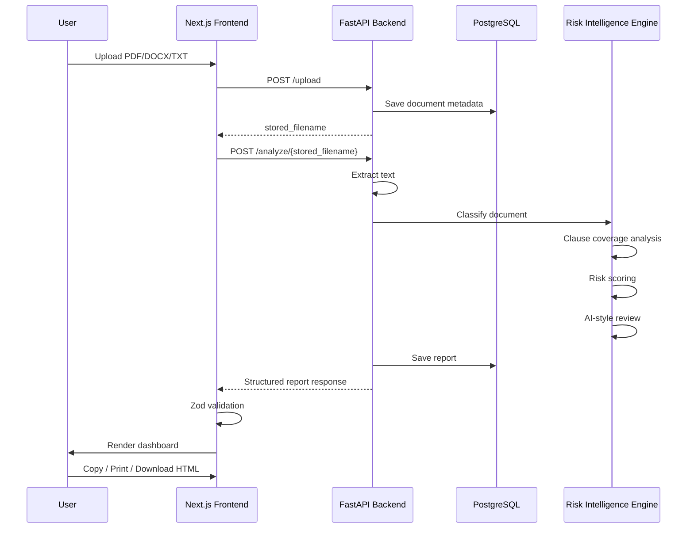

# DocuSense AI Architecture

DocuSense AI is organized as a full-stack document intelligence product.

## High-Level Flow

## Backend Responsibilities

- Upload document
- Store file metadata
- Extract document text
- Classify document type
- Analyze clause coverage
- Detect risky language
- Score risk and quality
- Generate structured review recommendations
- Persist analysis reports

## Frontend Responsibilities

- Provide upload/demo workflow
- Call backend APIs
- Validate API responses with Zod
- Render structured report dashboard
- Support copy, print, and HTML export actions

## Product Design Principle

DocuSense AI separates document type, domain/industry context, risk findings, review recommendations, and export workflow.

This keeps the product extensible for additional document types and AI integrations.
